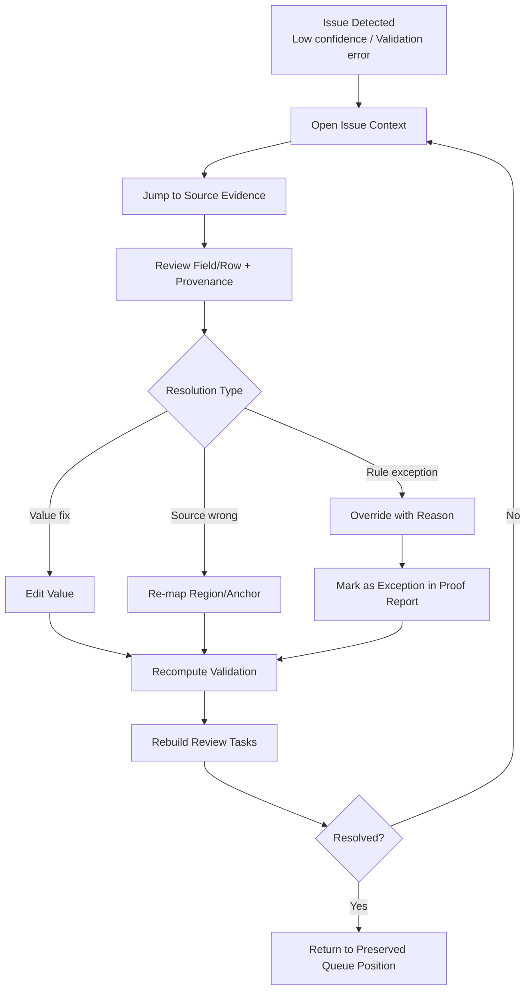
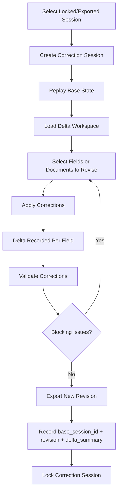
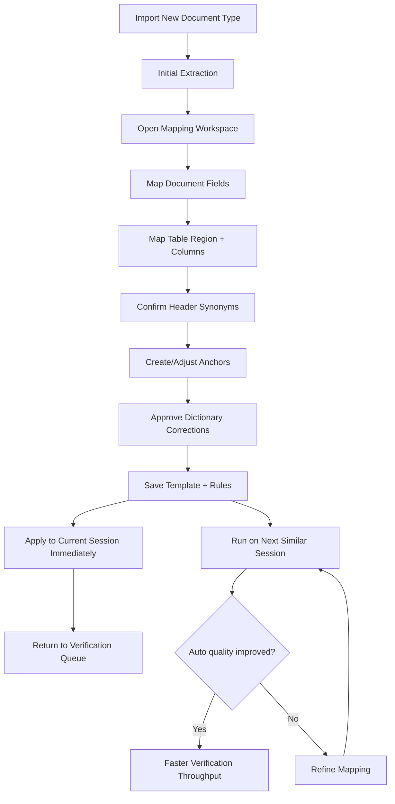

---
stepsCompleted:
  - 1
  - 2
  - 3
  - 4
  - 5
  - 6
  - 7
  - 8
  - 9
  - 10
  - 11
  - 12
  - 13
  - 14
lastStep: 14
inputDocuments:
  - /Users/jeremiahotis/projects/tabulara/_bmad-output/planning-artifacts/tabulara-prd-command-event-model.md
---

# UX Design Specification Tabulara

**Author:** Jeremiah
**Date:** 2026-02-18

---

<!-- UX design content will be appended sequentially through collaborative workflow steps -->

## Executive Summary

### Project Vision

Tabulara is a desktop-first, local document structuring system designed to transform inconsistent source documents into trustworthy structured datasets. Its UX philosophy prioritizes human-verified correctness over automated guessing, ensuring users can confidently review, validate, export, and later correct data without rewriting historical truth.

### Target Users

Primary users are moderately technical operations staff who are comfortable with desktop tools, spreadsheets, and file management, but are not developers. They typically process document batches in office workstation environments after intake has occurred elsewhere. Their priority is predictable, low-friction workflows that reduce cognitive load while preserving confidence in output quality.

### Key Design Challenges

The primary UX challenge is shifting users from manual typing and cleanup into structured review flows that can handle mixed formats, poor scans, handwriting, and layout variance without losing trust. The interface must surface uncertainty, exceptions, and validation failures early while keeping high-density desktop workflows understandable and efficient. It must also support provenance and correction history clearly enough that users can verify why each value is present and safely revise outputs later through correction sessions.

### Design Opportunities

Tabulara can create strong product differentiation by making users feel they are confirming system work rather than entering every value manually. A transparent traceability model that links each value to its source and command-event history can build trust and audit confidence. Proactive validation and reconciliation UX can reduce downstream errors, shorten processing time, and reinforce the core user outcome: "I trust this dataset and I know why it's correct."

## Core User Experience

### Defining Experience

The defining Tabulara experience is a fast verification loop where users confirm or correct extracted values with confidence. The primary repeated action is resolving queue items (accept, edit, lock) while staying anchored to document evidence. The most critical interaction is instant jump-to-source behavior from queue item to exact document location, so users can validate and resolve without searching.

The core loop is:

1. Select queue item
2. Source is auto-highlighted in document
3. Confirm or correct value
4. Move immediately to next item

If this loop feels fast, reliable, and predictable, the product succeeds.

### Platform Strategy

Tabulara is desktop-only at launch, optimized for mouse and keyboard with strong keyboard navigation for speed. The platform must remain fully offline with deterministic processing behavior (same inputs produce same outputs under same configuration). Performance must be smooth on standard office laptops without GPU dependency.

UX and system behavior must avoid blocking interactions: heavy processing runs in background with clear progress and responsive UI continuity. Platform capabilities leveraged include local filesystem workflows (including folder drag/drop), side-by-side dense workspace layouts, and OS keychain integration for vault unlock convenience.

### Effortless Interactions

The product should automate operational steps so users stay in review mode rather than execution mode. The following should run automatically whenever appropriate:

- Preprocessing suggestions after import
- Extraction after import or reprocess
- Validation after relevant changes
- Review queue generation
- Duplicate detection
- Learning-rule capture after confirmed corrections
- Continuous persistence (no manual save)

Tabulara should eliminate common manual burdens:

- Copying values into spreadsheets
- Manual total reconciliation
- Repeating known correction patterns
- Searching for source provenance
- Reconstructing tables from scratch per batch

### Critical Success Moments

The immediate "this is better" moment occurs when a user imports a real batch, opens verification, and confirms multiple values in rapid sequence while the document auto-focuses each source location. Within the first minute, the user should feel faster than manual entry.

The trust-critical failure to avoid is silent incorrectness: data that appears valid but is wrong or sourced from the wrong region without clear indication. "Wrong and unnoticed" is the highest-severity UX failure.

The make-or-break first-run flow is:

Import -> automatic extraction -> verification queue -> rapid confirmations/corrections -> clean export

If this works smoothly on messy real-world documents, adoption is likely.

### Experience Principles

1. Resolve in context: every queue decision must expose exact source evidence immediately.
2. Throughput with confidence: optimize for rapid multi-item verification without hidden risk.
3. Visible provenance: users must always understand why a value exists and where it came from.
4. Automation for toil reduction: automate repetitive mechanics, keep high-impact decisions explicit.

## Desired Emotional Response

### Primary Emotional Goals

Tabulara should make users feel focused, certain, and in control during verification. The intended emotional outcome is that users feel they are confirming known facts rather than searching for hidden errors. After export, users should feel relief and confidence that the dataset is complete and trustworthy, not tentatively correct.

The core emotional signature is calm trust. Where many OCR tools create anxious re-checking and lingering doubt, Tabulara should create closure.

### Emotional Journey Mapping

At the start of a batch, users should quickly feel oriented: what was processed, what requires review, and where to focus first. During high-volume queue cleanup, the emotional experience should remain steady and rhythmic, avoiding cognitive overload and decision fatigue.

When validation issues appear, users should feel guided and supported rather than blamed. Issues must be explained clearly so users do not feel surprised or confused. When returning later for correction sessions, users should feel confidence in historical continuity: prior work is preserved, understandable, and safe to build upon.

### Micro-Emotions

Priority emotional states to optimize:

1. Confidence
2. Trust
3. Control

Negative emotional states to aggressively prevent:

1. Uncertainty ("I don't know if this is right")
2. Fragility ("If I touch this, I might break it")
3. Exhaustion ("I have to manually check everything again")

### Design Implications

Trust-building UX behaviors should prioritize:

- Provenance visibility (exact source location and evidence for values)
- Deterministic behavior and repeatable outcomes
- Clear lock semantics that communicate immutability boundaries
- Explicit warnings with reasons when intervention is required

Subtle delight should come from operational fluency, not ornamentation. Appropriate delight moments include smooth focus transitions, lightweight verification confirmations, and unambiguous completion states after export. Decorative or playful visual effects should not distract from trust and throughput goals.

### Emotional Design Principles

1. Predictability creates confidence: users should be able to anticipate system behavior at every step.
2. Traceability creates trust: every important value should be explainable through visible evidence.
3. Stability creates control: users must feel safe making changes without risking historical integrity.
4. Fluency creates satisfaction: delight should emerge from smooth, low-friction workflow progression.
5. Guidance over judgment: validation and exceptions should coach users toward resolution, never create blame.

## UX Pattern Analysis & Inspiration

### Inspiring Products Analysis

Tabulara draws inspiration from three products that align with its core UX goals:

1. GitHub Pull Requests
   - Strength: review decisions tied to exact source context.
   - Strength: visible, durable history of what changed and why.
   - UX value for Tabulara: reinforces trust through traceable verification decisions and immutable session lineage.

2. Excel (filtering + quick editing workflows)
   - Strength: rapid scanning and confirmation across large data sets.
   - Strength: efficient keyboard-driven movement and editing flow.
   - Strength: predictable interaction behavior at scale.
   - UX value for Tabulara: informs high-throughput queue review and low-friction correction loops.

3. Notion (sidebar + detail pane structure)
   - Strength: calm spatial organization with low visual noise.
   - Strength: contextual detail visibility without losing navigation context.
   - UX value for Tabulara: supports side-by-side evidence review with clear orientation and reduced cognitive load.

Together these references define a combined UX target for Tabulara: review tied to source truth, verification speed, and interface clarity.

### Transferable UX Patterns

Navigation Patterns:
- Persistent left-side queue/navigation with clear item state, inspired by Notion's stable sidebar model.
- Context-preserving detail pane pattern where selected item details and evidence are shown without disorienting page changes.

Interaction Patterns:
- Keyboard-first verification progression inspired by Excel:
  - next/previous unresolved item
  - accept/edit/lock shortcuts
  - fast same-type batch confirmation
- Review-in-context jump model inspired by GitHub PR:
  - selecting an item focuses exact source region
  - decision and rationale remain tied to that source.

Visual Patterns:
- Calm, low-noise dense workspace (Notion influence) to reduce fatigue in long verification sessions.
- High-signal status indicators (Excel/GitHub influence) for confidence, validation state, and lock state.
- Inline provenance affordances that prioritize explainability over decorative flourish.

### Anti-Patterns to Avoid

- Black-box extraction outputs where users cannot see origin evidence for values.
- Heavy modal workflows that break verification rhythm and force context resets.
- Unpredictable keyboard behavior or hidden shortcut logic that reduces throughput trust.
- Overly decorative interfaces that reduce information density or distract from review tasks.
- Ambiguous validation messaging that flags issues without clear reason or resolution path.
- Mutating historical records in-place without clear revision lineage.

### Design Inspiration Strategy

What to Adopt:
- GitHub-style source-tied review model for every verification decision.
- Excel-like high-speed, keyboard-optimized scanning and correction flow.
- Notion-like calm sidebar/detail spatial organization for persistent orientation.

What to Adapt:
- Excel-style row movement adapted into queue-item verification semantics (not spreadsheet editing semantics).
- GitHub review history adapted into command-event and session-level provenance views suitable for operations users.
- Notion pane structure adapted for document evidence + field queue + unknown bucket workflow density.

What to Avoid:
- Any interaction pattern that hides evidence, causes state ambiguity, or weakens traceability.
- Any layout or animation choice that trades throughput and certainty for visual novelty.

Strategic Principle:
Tabulara should combine PR-style audit confidence, spreadsheet-grade speed, and calm structured navigation into a single verification-centric desktop experience.

## Design System Foundation

### 1.1 Design System Choice

Tabulara will use a **themeable design system with MUI as the base**, combined with a **custom interaction layer** for domain-critical workflows.

### Rationale for Selection

This choice balances implementation speed and behavioral control for a desktop-first productivity product.

Key reasons:
1. Tabulara requires high-density, keyboard-heavy, trust-critical workflows that exceed standard CRUD dashboard patterns.
2. Fully custom UI infrastructure would add major scope before core product risks (extraction, mapping, verification) are solved.
3. Ant Design is optimized for admin/form patterns and is likely to conflict with required verification-loop ergonomics.
4. MUI provides mature accessibility, predictable keyboard baselines, and robust component primitives while preserving customization flexibility.

Decision summary:
- Avoid Ant Design due to interaction rigidity for this use case.
- Avoid fully custom due to timeline and infrastructure cost.
- Use MUI foundation with custom behavior where product differentiation and correctness depend on it.

### Implementation Approach

Use MUI as structural infrastructure, then layer domain-specific interaction systems on top.

Foundation via MUI:
- Application shell and workspace layout
- Navigation panels and menus
- Dialogs, overlays, and baseline focus management
- Theming tokens (color, spacing, typography, density)
- Accessibility baseline patterns

Custom interaction layer for core product workflows:
- Verification queue behavior and keyboard traversal model
- Document viewer source-highlighting overlays
- Field/table mapping interactions
- Review queue navigation and resolution shortcuts
- Provenance affordances tied to command-event history

### Customization Strategy

Design and engineering should treat MUI as a controllable primitive library, not a visual identity.

Customization priorities:
1. Density controls tuned for long-session desktop productivity.
2. Focus states and keyboard affordances optimized for rapid verification loops.
3. Motion minimized and purposeful to preserve calm concentration.
4. Contrast and visual hierarchy tuned for confidence and error detectability.
5. Workspace styling refined to feel like a workstation tool, not a generic web dashboard.

Strategic principle:
Use MUI to accelerate reliable UI foundations; implement Tabulara-specific interaction patterns where trust, speed, and traceability are won or lost.

## 2. Core User Experience

### 2.1 Defining Experience

The defining Tabulara experience is:

Resolve one queued value directly against its source (focus -> verify -> confirm/correct -> advance) rapidly, with continuous provenance visibility and no hidden state.

This interaction is the product's center of gravity. If users can move quickly through queued values while continuously seeing source evidence, the system feels trustworthy and efficient. If this breaks, trust and throughput both degrade.

### 2.2 User Mental Model

Users begin in a document-first mindset:
"I need to process these documents."

After extraction, they transition into a queue-first operational mode:
"I need to clear this verification queue."

The UX should explicitly support this mental shift from spatial context (documents/pages) to procedural flow (item-by-item verification). The interface should avoid forcing users to choose between the two views; both should stay synchronized.

Closest interaction metaphors:

- Primary: code review (decision tied to exact evidence)
- Secondary: spreadsheet scanning (rapid sequential verification)

Checklist-style completion metaphors are insufficient because Tabulara decisions are evidentiary, not merely binary task completion.

### 2.3 Success Criteria

Core performance and usability targets for the defining interaction:

1. Median resolve time per queue item: under 2.5 seconds
2. Keyboard-only completion rate: >= 80% of queue actions
3. First-pass validation pass rate: >= 90%

Confidence proxy:
- Post-export correction sessions for the same batch should be rare; low immediate re-correction frequency indicates strong verification trust.

### 2.4 Novel UX Patterns

Pattern strategy is intentionally conservative:
- Primary reliance on established patterns users already understand:
  - PR-style review-in-context
  - Spreadsheet-speed keyboard navigation
- Product should feel familiar within 30 seconds of first serious use.

Required novel interaction:
- Persistent synchronized highlighting between structured value and spatial source region that remains stable at high navigation speed.

This novelty is necessary to remove source-hunting friction and preserve trust under throughput pressure.

### 2.5 Experience Mechanics

Initiation:
- User opens a session and enters verification workspace.
- Unresolved queue receives initial focus automatically.

Interaction loop:
1. Select next queue item (auto progression or manual selection)
2. Source region is highlighted and centered in the document view
3. User action: accept, edit, or lock
4. Focus advances immediately to next relevant item

Feedback:
- Value state updates instantly after action
- Provenance indicator remains continuously visible
- Queue remaining count updates in real time
- Validation state updates incrementally as queue is resolved

Completion:
- Queue reaches zero unresolved items
- Validation status is clean (or explicitly resolved)
- Export action becomes enabled
- Session can be finalized and locked

## Visual Design Foundation

### Color System

Tabulara adopts the provided **Quiet Authority canonical token system** as its visual baseline, with semantic mappings tuned for verification workflows.

Core visual posture:
- Calm, low-drama surfaces
- High legibility without stark contrast extremes
- Accent reserved for true decisions and primary actions
- Status colors used for semantics, not emotional urgency

Light mode canonical tokens (primary set):
- Primary: `#3F647E`
- App background: `#F6F4F1`
- Card background: `#FFFFFF`
- Secondary surface: `#EFE9E4`
- Text primary: `#2B2B2B`
- Text secondary: `#5F6A70`
- Border: `#D6DAD8`
- Divider: `#E4E7E5`
- Success: `#6F8F7A`
- Warning: `#C6A86B`
- Error: `#9A5A5A`
- Info: `#7A8A94`

Dark mode canonical tokens are preserved from the provided token spec for optional support.

Semantic UI mapping for Tabulara:
- Primary action and selected states use `--color-primary`
- Read-only context and evidence containers use secondary surface tokens
- Validation/error/warning/verified states map strictly to semantic token set
- Provenance highlighting must remain visible but restrained (no alarm-color bias)
- No raw hex values in product components; token-only usage is mandatory

### Typography System

Typography is overridden by explicit implementation rules.

Font stack:
- Primary (all surfaces): Inter
- Accent (headings only): Manrope
- System fallback: system-ui, -apple-system, BlinkMacSystemFont, "Segoe UI", sans-serif

Binding usage rules:
- Inter for body text, forms, labels, table/queue content, and operational UI copy
- Manrope for headings only
- No serif usage in product UI surfaces

Type scale (1.25 modular scale):
- `text-xs`: 12px / 1.4 (helper text, metadata)
- `text-sm`: 14px / 1.45 (secondary labels)
- `text-base`: 16px / 1.5 (default body)
- `text-md`: 18px / 1.55 (emphasized body)
- `text-lg`: 20px / 1.4 (section headers)
- `text-xl`: 24px / 1.35 (page headers)
- `text-2xl`: 30px / 1.3 (hero headers only)

Font weights:
- 400 (regular): body
- 500 (medium): labels, buttons
- 600 (semibold): headers only
- Bold emphasis is disallowed; emphasis should be created through spacing, hierarchy, or size changes.

### Spacing & Layout Foundation

Spacing is governed by the provided **4px base rhythm** and “calm density” principles.

Layout foundations:
- Desktop-first, multi-pane workspace optimized for verification throughput
- Stable spatial structure: queue/nav + document/evidence + detail/field context
- Constrained readable widths for text-heavy panes
- Dense but breathable component spacing to minimize fatigue over long sessions

Structural rules:
- Read-only data must look informational, not editable
- One primary decision/action focus at a time within decision surfaces
- Progressive disclosure for complexity; avoid forcing full-form scanning
- Avoid decorative spacing patterns that reduce information efficiency

### Accessibility Considerations

Accessibility is baseline, not optional.

Requirements:
- WCAG AA contrast compliance across light and dark themes
- Keyboard-first navigation support across core verification loop
- Clear focus states using canonical focus tokens
- Sufficient target sizes and predictable interaction zones
- Screen-reader compatible semantics for queue, source context, and validation states

Trust-critical accessibility implications for Tabulara:
- Validation reasons must be explicit and understandable
- Provenance context must remain perceivable during keyboard-driven navigation
- State changes (resolved, locked, flagged) must be communicated clearly without color-only reliance

## Design Direction Decision

### Design Directions Explored

Six design directions were explored through the UX direction showcase.

Evaluation outcome:
- Direction 1 best matched the core loop (queue -> evidence -> confirm -> advance) without over-optimizing for one dimension too early.
- Direction 2 was speed-forward too early.
- Direction 3 was trust-forward too early.
- Direction 4 was a useful refinement layer, not a base.
- Direction 5 assumed advanced-user density too early.
- Direction 6 offered onboarding support but risked persistent visual noise if used as default.

### Chosen Direction

Base direction is **Direction 1: Balanced Tri-Pane**.

Locked enhancement layers:
1. From Direction 3: stronger evidence highlight during active verification state only.
2. From Direction 4: persistent micro-context strip in details pane (field, rule, confidence).
3. From Direction 5: optional compact density mode, user-controlled and non-default.
4. From Direction 6: first-session inline guidance only, fading automatically after initial usage.

No structural pane-layout changes are required.

### Design Rationale

Direction 1 provides the most stable foundation for both onboarding clarity and expert throughput while preserving continuous provenance visibility.

Key rationale:
- Keeps the defining interaction loop unobstructed.
- Avoids early bias toward speed or trust at the expense of the other.
- Supports progressive sophistication through layered behaviors.
- Minimizes redesign risk by maintaining a stable information architecture.

Behavioral refinements before lock:
1. Active-item visual gravity shift:
   - evidence pane subtly brightens on selection
   - non-active panes subtly recede
2. Queue rhythm reinforcement:
   - persistent positional marker (e.g., \"Item 7 of 24\")
3. Lock state clarity:
   - lock state differentiated by structure (icon + border treatment + subdued surface), not color alone
4. Validation visibility rule:
   - validation feedback appears after queue completion or explicit user request, not as constant interruption during flow

### Implementation Approach

Implementation should proceed as:

1. Build Direction 1 tri-pane layout as canonical baseline.
2. Add behavioral overlays in phases:
   - Phase A: evidence emphasis + queue position anchor + lock-state differentiation
   - Phase B: persistent micro-context strip
   - Phase C: optional density mode and first-session onboarding hints
3. Preserve token and typography governance:
   - Quiet Authority token system
   - Inter (UI/body), Manrope (headings only), locked type scale/weight rules
4. Validate through usability gates:
   - median resolve time, keyboard action share, first-pass validation success

## User Journey Flows

### Primary Processing Journey

Goal: convert a messy batch into a trusted, export-ready dataset in one focused session.

```mermaid
flowchart TD
    A[Open Project] --> B[Create Session]
    B --> C[Import PDFs/Images]
    C --> D[Auto Preprocess]
    D --> E[Auto Extract]
    E --> E2{Mapping Needed?}
    E2 -- Yes --> M1[Go to Mapping and Teaching Journey]
    E2 -- No --> F[Open Verification Queue]
    M1 --> F
    F --> G{Queue Item}
    G --> H[Focus Source Region]
    H --> I[Accept / Edit / Lock]
    I --> J[Update Queue + Incremental Validation]
    J --> K{Items Remaining?}
    K -- Yes --> G
    K -- No --> L[Final Validation Gate (incremental checks already running)]
    L --> M{Blocking Issues?}
    M -- Yes --> N[Route to Exception Recovery]
    M -- No --> O[Export Dataset]
    O --> P[Lock Session]
    P --> Q[Done: Trusted Output]
```

### Exception Recovery Journey

Goal: resolve uncertainty/errors without breaking flow trust.



### Correction Session Journey

Goal: safely revise a finalized export while preserving immutable history.



### Mapping & Teaching Journey

Goal: convert a new/unfamiliar layout into future speed through learned structure.



### Journey Patterns

Common patterns across all four journeys:

1. Evidence-Synchronized Decisioning
- Every actionable item links to visible source context.
- Provenance remains visible through the decision loop.

2. Progressive Procedural Flow
- Users start from document context, then move into queue/mapping procedures.
- System keeps spatial and procedural views synchronized.

3. Guarded Immutability
- Finalized outputs are locked.
- Changes are handled through correction sessions, not overwrite.

4. Incremental Trust Feedback
- Queue count, validation state, and lock state update continuously.
- “No hidden state” is maintained at every transition.

5. Compounding Learning Loop
- Mapping/anchors/dictionary decisions are captured as reusable intelligence.
- Current session improves immediately and future sessions improve over time.

6. Deterministic Reprocessing
- Re-running preprocessing/extraction preserves confirmed decisions and only changes unresolved or explicitly invalidated data.

### Flow Optimization Principles

1. Keep the core loop uninterrupted.
2. Show only the next meaningful decision.
3. Preserve rhythm with auto-advance + keyboard-first traversal + positional anchors.
4. Defer blocking checks to the final gate while running incremental validation continuously.
5. Make finality explicit through structural lock-state cues and correction-path semantics.
6. Treat teaching as first-class workflow, not hidden side effect.
7. Never restart work: preserve queue position, preserve focus, and never resurface resolved items unless explicitly invalidated.

## Component Strategy

### Design System Components

Using MUI as foundation (with tokens and typography rules already locked), Tabulara will use MUI for infrastructure components and avoid relying on MUI for core verification mechanics.

Use MUI for:
- App shell/layout primitives
- Navigation chrome, menus, dialogs, tabs
- Standard form controls and utility inputs
- Accessibility primitives and focus baselines
- Secondary data tables (non-core workflows)

Coverage constraint:
- MUI DataGrid is allowed for secondary tabular views only.
- Core verification queue behavior must be custom to preserve keyboard rhythm, lock semantics, and provenance flow guarantees.

### Custom Components

#### VerificationQueue
**Purpose:** Primary item-by-item verification workspace list.  
**Usage:** Main left-pane interaction surface during processing/review.  
**Anatomy:** Item rows, confidence markers, lock markers, status markers, positional index.  
**States:** default, focused, selected, resolved, locked, low-confidence, error-linked.  
**Accessibility:** Full keyboard traversal, roving focus, clear item semantics.

#### ReviewTaskOrchestrator
**Purpose:** Owns queue generation, ordering, regrouping, batching, and return-to-position behavior.  
**Usage:** Cross-cutting journey engine for verification rhythm.  
**Behavior:** Rebuilds tasks after edits/re-maps/overrides while preserving user orientation.

#### EvidenceViewer
**Purpose:** Source-of-truth document pane with synchronized highlighting.  
**Usage:** Always paired with active queue item and provenance links.  
**Behavior:** Zoom-to-source, highlight persistence, optional multi-highlight, active emphasis shift.

#### ProvenanceStrip (or ProvenancePanel if interaction scope expands)
**Purpose:** Persistent micro-context (field, rule, confidence, source metadata).  
**Usage:** Detail pane anchor during rapid verification.  
**Behavior:** Never hidden during active loop.

#### ProvenanceLink
**Purpose:** Ubiquitous jump-to-evidence affordance attached to values across UI.  
**Usage:** Queue rows, detail views, validation references, reports.  
**Behavior:** Click/keyboard action jumps and highlights source immediately.

#### VerifyActionBar
**Purpose:** Primary verification action cluster.  
**Usage:** Accept/Edit/Lock/Next plus keyboard hinting and auto-advance behavior.  
**States:** default, action-confirmed, disabled (no target), locked-context.

#### ValidationStatusRail
**Purpose:** Non-intrusive persistent validation state visibility with final export gate behavior.  
**Usage:** Continuous awareness during flow; blocking gate only at finalization.  
**Behavior:** Incremental updates in-session, explicit gate state at export readiness.

#### LockStateBadge
**Purpose:** Standardized lock semantics indicator across field/row/document/session levels.  
**Usage:** All lockable entities.  
**Behavior:** Structural distinction (icon + border + surface treatment), not color-only.

#### SessionProgressHeader
**Purpose:** Persistent orientation strip.  
**Usage:** Unresolved count, item x of y, validation state, export readiness.  
**Behavior:** Rhythm anchor; must not disappear during core flow.

#### MappingTableTrainer
**Purpose:** Mapping + teaching for new layouts/tables/headers/rules.  
**Usage:** Mapping branch and refinement loops.  
**Behavior:** Captures reusable patterns, applies improvements immediately and to future runs.

#### UnknownBucketPanel
**Purpose:** Displays unassigned extracted text and supports quick assignment.  
**Usage:** During mapping/verification to reduce uncertainty and avoid hidden extraction loss.  
**Behavior:** Fast assign-to-field actions; provenance retained.

#### CorrectionDeltaInspector
**Purpose:** Field/document-level change inspection for correction sessions.  
**Usage:** Revision workflows and export trace context.  
**Behavior:** Delta visibility, comparison clarity, audit-safe revision confirmation.

### Component Implementation Strategy

1. Build all custom components on MUI primitives and locked design tokens.
2. Keep interaction logic explicit in domain components (avoid hiding trust-critical behavior in generic utility layers).
3. Enforce invariants in component contracts:
- no hidden state
- preserved queue position/focus after actions
- deterministic reprocessing effects
- explicit lock/finality semantics
4. Standardize keyboard model across queue, action bar, provenance navigation, and mapping interactions.
5. Instrument components with telemetry for success criteria (resolve time, keyboard share, validation pass behavior).

### Implementation Roadmap

#### Phase 1 - Core Verification Backbone
- VerificationQueue
- ReviewTaskOrchestrator
- EvidenceViewer
- VerifyActionBar
- SessionProgressHeader
- ValidationStatusRail (baseline)
- LockStateBadge
- ProvenanceLink (initial)
- ProvenanceStrip (baseline)

#### Phase 2 - Learning and Mapping Acceleration
- MappingTableTrainer
- UnknownBucketPanel
- ProvenanceLink expansion across broader UI surfaces
- ProvenanceStrip -> ProvenancePanel evolution if required

#### Phase 3 - Revision and Advanced Workflows
- CorrectionDeltaInspector
- Advanced validation rail interactions and report drilldowns
- Expert density mode refinements and onboarding-hint retirement controls

## UX Consistency Patterns

### Button Hierarchy

Core rules:
1. One primary action per decision surface.
2. Secondary actions remain visually subordinate.
3. Destructive actions are never primary-styled.

Verification-specific rules:
1. Primary action is confidence-driven:
   - Primary = `Accept` when confidence >= configured threshold.
   - Primary = `Edit` when confidence < threshold.
2. `Lock` is never primary (finality must remain deliberate).
3. `Next` is not a standalone primary button; progression is the outcome of decision actions (accept/edit/lock).

Principle:
Action hierarchy must reflect certainty state, not arbitrary control ordering.

### Feedback Patterns

Core rules:
1. Incremental feedback is calm and non-blocking during active verification.
2. Blocking validation appears only at explicit gate points (finalization or user-invoked checks).

Required feedback semantics:
1. Every decision change must show explicit state transition:
   - Open -> Resolved -> Locked
2. Validation feedback must always include:
   - cause
   - location
   - actionable resolution path
3. Overrides require:
   - explicit reason
   - persistent in-context exception marker (not report-only visibility)
4. Confidence changes are never silent:
   - UI must disclose why confidence changed (e.g., rule applied, source remap, reprocessing update).

### Form Patterns

Core rules:
1. Read-only facts never look editable.
2. Inline edits preserve queue position and focus.
3. Lock semantics are structural, not color-only.

Machine-vs-human value distinction:
1. Machine-origin values:
   - neutral informational surface
2. User-edited values:
   - subtly emphasized review surface
3. Locked values:
   - reduced edit affordance (control removal, cursor behavior, explicit lock markers)

Stability requirement:
- Typing/edit actions must not alter selected queue item or unexpectedly shift viewport/scroll context.

### Navigation Patterns

Core rules:
1. Stable tri-pane workspace remains persistent.
2. Keyboard-first traversal is supported across queue, action bar, and provenance actions.
3. Queue position is first-class orientation state.

Navigation guarantees:
1. Leaving and returning to workspace restores prior queue context unless user intentionally advanced.
2. Provenance jumps do not mutate queue selection unless explicitly confirmed.
3. Position indicators remain persistent:
   - `Item x of y (z total)` where relevant.

### Modal and Overlay Patterns

Overlay classification and allowed behavior:

1. Verification overlay
- Inline behavior
- No global dimming
- No rhythm interruption

2. Mapping overlay
- Focused interaction surface
- Must retain queue context and return position

3. Blocking gate
- True modal allowed only for final decision gates (e.g., export lock boundary)

Modal prohibitions:
- No modals for warnings
- No modals for hints/onboarding nudges
- No modals for background processing updates

### Empty, Loading, and Error Patterns

Empty states:
1. Empty verification queue includes affirmative completion tone:
   - communicates verified completion and next readiness.
2. Empty unknown bucket explicitly states extraction accountability is complete.

Loading states:
1. Background processing remains visible but non-blocking when possible.
2. Loading must communicate scope:
   - e.g., “Reprocessing 3 pages.”

Error states:
1. Errors never remove already completed work from view.
2. Error context must preserve user orientation and recovery path.

### Search and Filter Patterns

Core rules:
1. Queue filters support field type, confidence band, lock state, and validation context.
2. Filter behavior must preserve orientation and recoverability.

Mandatory behaviors:
1. Validation errors are never hidden by default filtering behavior.
2. Clearing filters returns user to last active queue item.
3. Display both local and global context:
   - `Item 4 of 10 (23 total)`.

### Undo and Recovery Patterns

Undo is mandatory for trust-critical interaction safety.

Undo rules:
1. Single-step undo is always available within active session scope.
2. Undo never crosses lock boundaries.
3. Undo restores:
   - prior value state
   - prior queue position
   - prior focus context.

Recovery principle:
Reversibility must be explicit, bounded, and orientation-preserving.

### Additional Patterns

Consistency integration rules:
1. All patterns must remain token-driven (no raw hex or ad hoc styling).
2. All pattern behavior must preserve “no hidden state.”
3. All journey-critical actions must maintain provenance visibility and deterministic navigation anchors.

## Responsive Design & Accessibility

### Responsive Strategy

Tabulara is desktop-first, with the tri-pane verification workspace as canonical.

Responsive behavior invariants:
1. Layout may change by breakpoint, but interaction order must not change.
2. Verification loop remains continuous at all supported sizes:
   - Queue -> Evidence -> Action
3. No breakpoint may add extra steps to resolve an item.

Desktop (canonical):
- Full tri-pane verification and full authoring capabilities.

Tablet (verification-capable, mapping-restricted in phase 1):
Allowed:
- Accept/Edit/Lock actions
- Provenance jump and evidence inspection
- Validation issue resolution
Disallowed (phase 1):
- Mapping trainer
- Schema editing
- Bulk operations requiring precision-heavy controls

Small viewport (inspection-first mode):
Allowed:
- View provenance context
- Read validation results
- Mark items for later review
Disallowed:
- Finalizing/destructive actions (lock/export)

### Breakpoint Strategy

1. `>=1280px`
- Full tri-pane default.

2. `1024-1279px`
- Tri-pane with collapsible details rail.

3. `768-1023px`
- Dual-pane (queue + evidence), detail/provenance context as slide-over panel.

4. `<768px`
- Inspection-first operational mode (non-finalizing).

Breakpoint guarantee:
- Breakpoint transitions must preserve queue position and active context.

### Accessibility Strategy

Baseline:
- WCAG AA minimum compliance is mandatory.

Operational accessibility requirements (trust-critical):
1. Entire verification loop keyboard-operable:
   - next/previous item
   - accept/edit/lock
   - jump to evidence
   - undo
2. No keyboard traps in overlays.
3. Focus indicator must remain visible, including while evidence highlight overlays are active.

Screen-reader interaction model:
1. Queue modeled as structured list semantics (not generic table fallback).
2. Item announcement includes:
   - field name
   - value
   - confidence
   - state (open/resolved/locked)
   - source location
3. Evidence jump triggers explicit announcement:
   - e.g., “Source located: page 1 line 12.”

Cognitive accessibility requirements:
1. No auto-dismiss for critical messages.
2. Validation updates must never force focus relocation.
3. Error content must include actionable resolution hints.

### Testing Strategy

Responsive testing:
1. Real laptop breakpoints first, then tablet classes.
2. Breakpoint transition tests must verify preserved queue position/focus.

Accessibility testing:
1. Keyboard-only completion tests for core journeys.
2. Screen reader tests (VoiceOver + NVDA minimum).
3. Automated and manual contrast checks.
4. Overlay focus/escape-path validation.

Reliability-aligned accessibility tests:
1. Deterministic navigation test:
   - repeating identical keyboard sequence yields identical outcomes.
2. Recovery test:
   - interrupt mid-queue, reopen app, restore to same active item/context.

Performance-aware usability tests on typical office hardware:
1. Evidence highlight response < 100ms.
2. Queue advance response < 150ms.

### Implementation Guidelines

1. Desktop workflow is the source of truth; smaller breakpoints are deliberate adaptations, not uncontrolled collapses.
2. Provenance guarantee:
- no visible value without reachable source reference at any breakpoint.
3. Truncation rule:
- any truncated value must expose full content via keyboard focus (not hover-only).
4. Validation-critical content must remain discoverable under responsive collapse.
5. Under load, interaction latency targets remain mandatory to prevent accessibility degradation.
